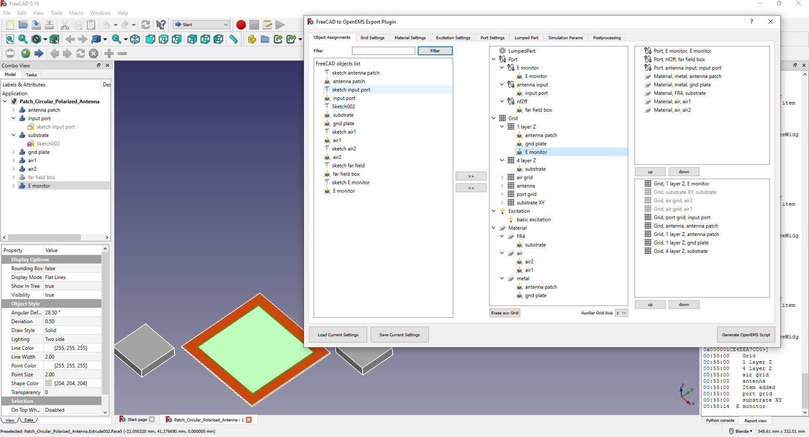

FreeCAD-OpenEMS-Export
======================
Simple GUI plugin for FreeCAD to export current model for EM simulation in OpenEMS

What is OpenEMS
===============
According to www.openems.de openEMS is a free and open electromagnetic field solver using the FDTD method. Matlab or Octave are used as an easy and flexible scripting interface.

FDTD means finite distance time domain, it's technique to simulate electromagnetic fields. In pracitce model which is supposed to be simulated is meshed and afterward material constants, ports, probes and other parameters are defined. During simulation electric and magnetic field is excited in appropriate mesh points and propagation of electromagnetic wave is calculated.
This method is easy to implement based on Yee's method (https://en.wikipedia.org/wiki/Finite-difference_time-domain_method) and provide good results, advantage of this method over other MoM (method of moments) which is also used to calculate different parameters for antennas is that also materials other than air can be used. In practice this means you can simulate parameters for PCB antennas or simulate electromagnetic wave propagation through any other real models since you know electric parameters of used materials in model (material permitivity, permeability, conductivity and loss parameters).

What's this plugin for
======================
OpenEMS itself is FDTD solver implemented in C++ language. Its author Tobias Liebzig made outstanding work, not just to implement solver itself but also provided Matlab (also Octave) interface and programmed AppCSXCAD application to visualize scripted model to visually inspect model, its meshing and also to modify model itself.

So when using openEMS you have to define your model in Matlab/Octave script what required to study Matlab/Octave interface and its quite exhausting and many thing can go wrong till you figure out how to write your script right. Also to script your model is easy till you want to simulate simple structures but become hard at point you want to simulate more complex structure composed from different materials not mentioning if you want to define complex shapes and still have easy control over their geometry.

On the other hand there is possibility to import into simulation model STL files what brings possibility to define complex structures in some 3D CAD and after import them into simulation. If this all is already provided there was still gap between defining simulation in script and 3D CAD, so this plugin for FreeCAD was created.

This plugin is GUI application which works over FreeCAD, you model your structure in it and afterwards define whole simulation in additional GUI, when everything is done plugin will create Matlab/Octave script which you have to run to simulate model. Also there are options to generate postprocessing scripts to evaluate S parameters and fields for defined structure.

Workflow is similar to Ansoft HFSS, you defines materials, ports, lumped parts, excitation and assign these properties to FreeCAD model objects.

To make long story short below is picture already defined simulation in plugin GUI and also few examples are provided for patch antenna, helical antenna and other. At first sight maybe it seems little hard, but to script these simulation without this plugin will be much harder :)

The main purpose of this GUI is to made easy setup simulation and help to define mesh for it. Right meshing is crucial when using FDTD simulation, it has affect on results. There are some help function like displaying defined mesh lines in FreeCAD model, setting priorities for mesh gridlines and make mesh grid setting understandable for normal people.

